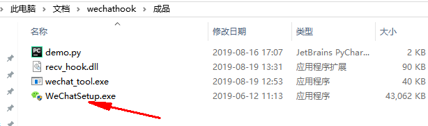
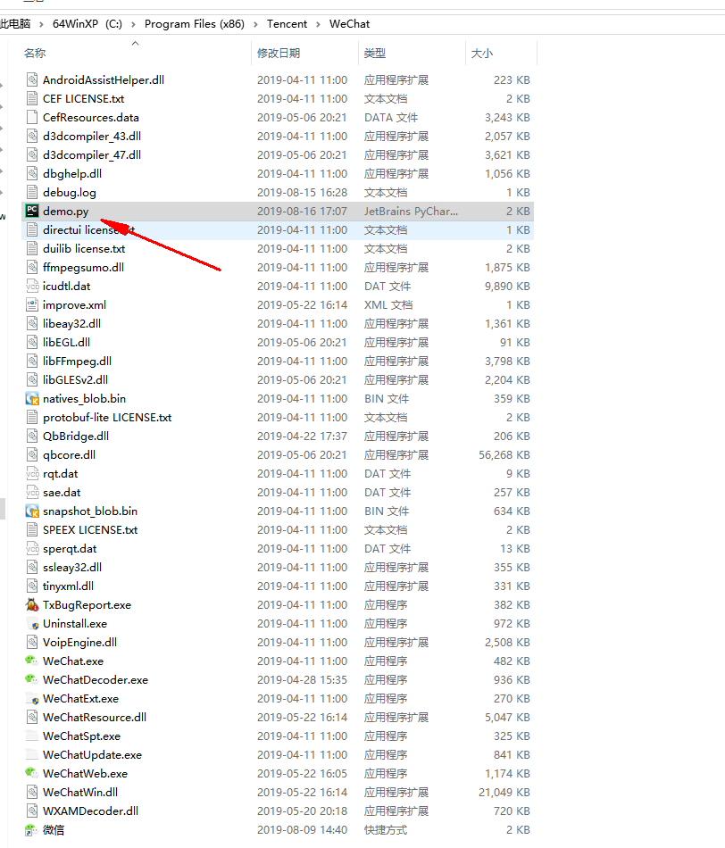

# wechathook
借助微信hook，拦截修改某些call，填充进我们的Python代码，进行微信公众号文章的爬取

## 注入器
注入dll进程序中

## DLL
实现hook功能，申请内存，修改call，在里面写调用python逻辑

## Python代码
为了方便调用和后续的修改，将需要暴漏的数据发送到python代码中，在c++中像调用模块一样调用python代码

暴漏的数据是xml格式：

```xml
<msg> <appmsg appid="" sdkver="0"> 	<title><![CDATA[我做减肥药那几年，减肥药行业内的惊人内幕]]></title> 	<des><![CDATA[今天在这里写这个文章，只是想给自己的过去告个别，也给后人一个警醒。]]></des> 	<action></action> 	<type>5</type> 	<showtype>1</showtype>     <soundtype>0</soundtype> 	<content><![CDATA[]]></content> 	<contentattr>0</contentattr> 	<url><![CDATA[http://mp.weixin.qq.com/s?__biz=MzU4ODAwNDg1MA==&mid=100000311&idx=1&sn=5537be62b5537a195f52f350bd947b16&chksm=7de22eaa4a95a7bca1c3b7c46ad18b23d5153b4dd0649d74941a68324faff83598ee1758ae61&scene=0#rd]]></url> 	<lowurl><![CDATA[]]></lowurl> 	<appattach> 		<totallen>0</totallen> 		<attachid></attachid> 		<fileext></fileext> 		<cdnthumburl><![CDATA[]]></cdnthumburl> 		<cdnthumbaeskey><![CDATA[]]></cdnthumbaeskey> 		<aeskey><![CDATA[]]></aeskey> 	</appattach> 	<extinfo></extinfo> 	<sourceusername><![CDATA[]]></sourceusername> 	<sourcedisplayname><![CDATA[]]></sourcedisplayname> 	<mmreader> 		<category type="20" count="1"> 			<name><![CDATA[聚财青年会]]></name> 			<topnew> 				<cover><![CDATA[http://mmbiz.qpic.cn/mmbiz_jpg/HR4f0zb1p6zqSHeHNwPyX2q5ezXmu48MSoCuwoNyuXl43JuAYOnslw63tb9cficf0q8dWhMObZ2hGibzIiaeAFTCA/640?wxtype=jpeg&wxfrom=0]]></cover> 				<width>0</width> 				<height>0</height> 				<digest><![CDATA[今天在这里写这个文章，只是想给自己的过去告个别，也给后人一个警醒。]]></digest> 			</topnew> 				<item> 	<itemshowtype>0</itemshowtype> 	<title><![CDATA[我做减肥药那几年，减肥药行业内的惊人内幕]]></title> 	<url><![CDATA[http://mp.weixin.qq.com/s?__biz=MzU4ODAwNDg1MA==&mid=100000311&idx=1&sn=5537be62b5537a195f52f350bd947b16&chksm=7de22eaa4a95a7bca1c3b7c46ad18b23d5153b4dd0649d74941a68324faff83598ee1758ae61&scene=0#rd]]></url> 	<shorturl><![CDATA[]]></shorturl> 	<longurl><![CDATA[]]></longurl> 	<pub_time>1512121242</pub_time> 	<cover><![CDATA[http://mmbiz.qpic.cn/mmbiz_jpg/HR4f0zb1p6zqSHeHNwPyX2q5ezXmu48MSoCuwoNyuXl43JuAYOnslw63tb9cficf0q8dWhMObZ2hGibzIiaeAFTCA/640?wxtype=jpeg&wxfrom=0|0|0]]></cover> 	<tweetid></tweetid> 	<digest><![CDATA[今天在这里写这个文章，只是想给自己的过去告个别，也给后人一个警醒。]]></digest> 	<fileid>100000310</fileid> 	<sources> 	<source> 	<name><![CDATA[聚财青年会]]></name> 	</source> 	</sources> 	<styles></styles>	<native_url></native_url>    <del_flag>0</del_flag>     <contentattr>0</contentattr>     <play_length>0</play_length> 	<play_url></play_url> 	<player><![CDATA[]]></player> 	<template_op_type>0</template_op_type> 	<weapp_username><![CDATA[]]></weapp_username> 	<weapp_path><![CDATA[]]></weapp_path> 	<weapp_version>0</weapp_version> 	<weapp_state>0</weapp_state>     <music_source>0</music_source>     <pic_num>0</pic_num> 	</item> 		</category> 		<publisher> 			<username><![CDATA[gh_3c021a4b8e86]]></username> 			<nickname><![CDATA[聚财青年会]]></nickname> 		</publisher> 		<template_header></template_header> 		<template_detail></template_detail> 	    <forbid_forward>0</forbid_forward> 	</mmreader> 	<thumburl><![CDATA[http://mmbiz.qpic.cn/mmbiz_jpg/HR4f0zb1p6zqSHeHNwPyX2q5ezXmu48MSoCuwoNyuXl43JuAYOnslw63tb9cficf0q8dWhMObZ2hGibzIiaeAFTCA/640?wxtype=jpeg&wxfrom=0]]></thumburl> 	                               	 </appmsg><fromusername><![CDATA[gh_3c021a4b8e86]]></fromusername><appinfo><version>0</version><appname><![CDATA[聚财青年会]]></appname><isforceupdate>1</isforceupdate></appinfo></msg>
```

## 成品运行

### 1.安装相应版本微信

因为每个版本call偏移不同，安装成品目录下的微信 2.6.8.52版本



### 2.注入DLL

打开登陆微信后，点击wechat_tool.exe会把dll注入微信中


### 3.具体业务逻辑

具体业务逻辑修改demo.py 因为需要在c++中调用python，需要将demo.py修改好后放入微信的程序的根目录，或者python的Lib\site-packages目录下作为第三方模块才能被找到




### 4.作者微信


